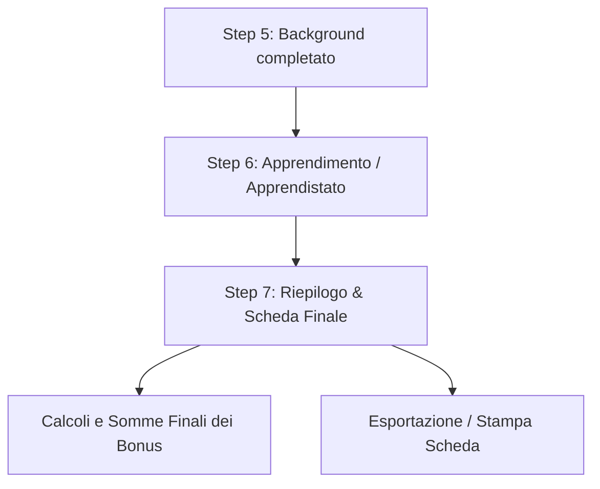

# Riepilogo Attività & Stato del Progetto (MERP Companion)

Questo documento riassume lo stato del lavoro svolto finora sul **Character Wizard** del MERP Companion e traccia la strada per i prossimi passi. È salvato all'interno della cartella di progetto `docu/` per consentire una facile consultazione dall'IDE.

---

## 1. Stato Attuale del Character Wizard

I primi **5 passaggi** del flusso di creazione del personaggio (definito in [merp_compainion-pg_creation_workflow-v1.md](file:///Users/yagni/Geek/antigravity/merpcomp/docu/merp_compainion-pg_creation_workflow-v1.md)) sono stati completati ed integrati.

### Step Implementati e Dati Salvati in `characterData`

| Step Workflow | Componente React | Dati Salvati in Stato | Note / UI Implementata |
| :--- | :--- | :--- | :--- |
| **1. Popolo e Cultura** | `RaceStep.jsx` | `characterData.race` | Selezione del popolo con applicazione automatica dei bonus razziali. |
| **2. Scelta Professione** | `ProfessionStep.jsx` | `characterData.profession` | Selezione della professione (Guerriero, Mago, Scout, ecc.). |
| **3. Caratteristiche** | `StatsStep.jsx` | `characterData.stats`   `characterData.statsPool` | Generazione con tiri D100 (con soglie 90/75 auto-applicate per professione) o con distribuzione di 400 punti. |
| **4. Adolescenza** | [AdolescenceStep.jsx](file:///Users/yagni/Geek/antigravity/merpcomp/src/components/CharacterWizard/steps/AdolescenceStep.jsx) | `characterData.skills`   `characterData.magicRealm` | Visualizza le abilità primarie calcolando la somma di adolescenza e professione. Gestisce la scelta del Reame per Guerriero/Scout. |
| **5. Opzioni Background** | [BackgroundStep.jsx](file:///Users/yagni/Geek/antigravity/merpcomp/src/components/CharacterWizard/steps/BackgroundStep.jsx) | `characterData.background` | Gestione interattiva di lingue e opzioni (gradi abilità, caratteristiche, abilità e oggetti speciali, denaro). |

---

## 2. Modifiche Recenti (Dettaglio Tecnico)

### Risoluzione Bug Critici e Loop
* **Separazione dei Modificatori di Background (`compiledModifiers`)**: In precedenza, la modifica delle abilità nel Background creava un loop infinito poiché tentava di aggiornare direttamente `characterData.skills` (che innescava lo useEffect di ricalcolo dell'adolescenza). Abbiamo spostato i modificatori in `characterData.background.compiledModifiers` (contenente `statsBonus`, `skillBgRanks`, `secondarySkills`, `gold`). Saranno sommati solo nella scheda finale.
* **Correzione Sintassi Javascript**: Risolti errori di accesso a proprietà con spazi nel file `AdolescenceStep.jsx` (es. `profession['liste incantesimi']`).
* **Correzione Tabella Caratteristiche & Bonus (Fase 7 - Riepilogo Creazione)**:
  * Eliminata la colonna "Finale" per evitare la somma scorretta tra il punteggio della statistica (scala 1-100) e il bonus del popolo.
  * Aggiunta la colonna "Bonus naturale" che effettua la ricerca del bonus sulla base delle statistiche (`raw + bgMod`).
  * Rinominate le colonne per maggiore chiarezza e conformità con il regolamento MERP: `Base` -> `Statistiche`, `Razza` -> `Bonus popolo`, `BG` -> `Bonus BG`, `Bonus` -> `Bonus tot.` (somma di bonus naturale e bonus popolo).
  * Aggiornati i Tiri Resistenza (TR) per sommare correttamente il modificatore del popolo e il bonus totale (`bonusTot`) della caratteristica associata (`IN` per Essenza, `IT` per Flusso, `CO` per Veleno e Malattia).
  * Corretto il calcolo del bonus caratteristica delle abilità (`carattBonus`) affinché utilizzi il `bonusTot` della caratteristica anziché il solo bonus naturale.

### Ottimizzazione UI e CSS
* **Fix Utility CSS**: Poiché Tailwind non è presente nel progetto, molte classi di layout (es. `flex-col`, `gap-5`, `grid-cols-3`) non avevano effetto. Abbiamo arricchito [index.css](file:///Users/yagni/Geek/antigravity/merpcomp/src/index.css) con un set completo di utility Tailwind-like esplicite.
* **Layout delle Opzioni**: Le opzioni di background in `BackgroundStep.jsx` ora si dispongono correttamente in verticale, una sotto l'altra, man mano che vengono scelte.
* **Interazione Specifica per Categoria**:
  * **Gradi delle abilità**: Scelta tra Primarie (+2) e Secondarie (+5) con dropdown dinamico.
  * **Aumento delle caratteristiche**: Scelta +2 a una o +1 a tre statistiche. Mostra in tempo reale il valore `Corrente → Nuovo` e indica se il bonus naturale migliora (`Bonus migliora ✓`).
  * **Lingue**: Dropdown filtrato per lingue non ancora a livello 5. L'opzione imposta automaticamente la lingua scelta a Grado 5.
  * **Abilità Speciali**: Campo tiro 1D100 + pulsante 🎲 Tira. Ricerca automatica dal JSON. Se il tiro è 01-50 propone la scelta di una primaria (+5 spec), se 51-55 propone una secondaria (+15 spec).
  * **Oggetti Speciali**: Lista delle 8 possibili casistiche magiche (+10, addizionatori, incantesimi giornalieri) con input testuale per specificare l'oggetto.
  * **Denaro**: Calcolo e visualizzazione delle Monete d'Oro ottenute in base al tiro 1D100.

---

## 3. Road Map: Prossimi Task da Sviluppare

Ecco la pianificazione dei prossimi moduli necessari per completare il flusso di creazione:

### Task 1: Sviluppo del Componente `LearningStep.jsx` (Fase 6)
Consente lo sviluppo delle abilità tramite i **Punti Sviluppo (PS)** accumulati con l'apprendistato.
* **Caricamento Budget PS**: Recupero del budget di PS per categoria in base alla professione scelta da `TGP_4-sviluppo_abilità_professioni.json`.
* **Assegnazione Gradi**:
  * Il costo per aumentare un'abilità di 1 grado è **1 PS**.
  * Il costo per aumentarla di 2 gradi è **3 PS**.
  * Massimo 2 gradi di incremento per livello (eccetto *Manovre in Movimento* che non hanno limite).
* **Gestione Percezione**: Consente di trasferire punti da altre categorie a Percezione con tasso 1:1.
* **Trasferimento Punti Sviluppo**: 
  * Costo **2:1** se la categoria di destinazione ha già almeno un PS base da professione.
  * Costo **4:1** se la categoria di destinazione ha 0 PS base da professione.
* **Liste Incantesimi**: Ogni PS assegnato a una lista equivale a un incremento del 20% nella probabilità di apprenderla.

### Task 2: Sviluppo del Componente `SummaryStep.jsx` (Fase 7)
La scheda finale che calcola e aggrega tutti i valori definitivi per il personaggio.
* **Somma Finale del Bonus**:
  $$\text{Bonus Finale} = \text{Bonus Gradi (TB\_4)} + \text{Bonus Caratteristica (TB\_1)} + \text{Bonus Popolo (TB\_3)} + \text{Bonus Professione (TB\_6)} + \text{Bonus Oggetti} + \text{Bonus Speciale}$$
* **Calcolo Tiri Resistenza (TR)**: Somma dei bonus base della statistica associata + modificatori del popolo.
* **Consolidamento Lingue**: Griglia finale con tutte le lingue conosciute e il relativo livello.
* **Calcolo Monete d'Oro**: 2 MO base + eventuali monete ottenute dalle opzioni di background.
* **Esportazione PDF/Stampa**: Fornire una vista ottimizzata per la stampa cartacea o salvataggio.
